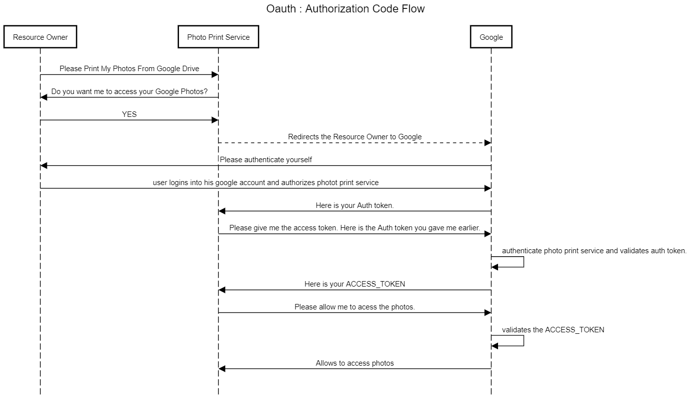

# Oauth
## What is OAuth?
* Oauth is an specification or protocol that allows a user to grant limited access to their resources residing on one site, to another site.
* For Example, You have your photos on Google Drive. Now you want an another app called Photo Printing App to print you photos residing in Google Drive. 
* Google Drive and Photo Printing service, both will communicate using OAuth.
* The prerequisite of using OAuth is that, the user is already authenticated by both services that need to communicate, already.
* So Oauth is meant to authorization between services.
* It is not meant for authentication.
* Also it is only meant to authorize services, not people.
* But many people also have found ways to authenticate uing Oauth. e.g Social Login using Facebook, Google etc
* Services use Access Tokens to access protected Resources.

## Oauth Key Terms

### 1. Resource (Protected Resources)
This is what other services want to access. Here in example of Google Photos, the Photos on the Google Drive are protected resources.

### 2. Resource Owner
An entity that is capable of granting access to to protected resource.
The user who has the access of his Google Photos Service is the resource owner of its photos on its google drive.

### 3. Resource Server
The server which is hosting the protected resource.
The Google Drive is the resource server. 

### 4. Client
Client is the app that needs to access the protected resource on behalf of the Resource owner and with resource owner's authorization. In our example, Photo Printing App is the Client.

### 4. Authorization Server
The server which is responsible for the security of the protected resource, is call authorization server. It first authrizes the client then issues access token so that client can access the protected resource.

## Oauth Flows
### 1. Authorization Code Flow

In this flow the authorization server gives back an Auth Token to the client app, after the user has authorized the client app.
The client app then exchanges this Auth Token with the Access Token, which the client app will use to access the protected resources.
The authorization server validates the Auth key provided by the client app with the client secret, then only it issues an Access token to the client app.

This also means the access token is never visible to the user, so it is the most secure way to pass the token back to the application, reducing the risk of the token leaking to someone else.

#### for more check below link:
https://www.oauth.com/oauth2-servers/server-side-apps/authorization-code/

#### Authorization Code Flow Sequnce diagram
)

#### Sequence Text

* Resource Owner->Photo Print Service: Please Print My Photos From Google Drive
* Photo Print Service->Resource Owner: Do you want me to access your Google Photos?
* Resource Owner->Photo Print Service: YES
* Photo Print Service-->Google : Redirects the Resource Owner to Google
* Google->Resource Owner: Please authenticate yourself
* Resource Owner->Google: user logins into his google account and authorizes photot print service
* Google->Photo Print Service: Here is your Auth token.
* Photo Print Service->Google: Please give me the access token. Here is the Auth token you gave me earlier.
* Google->Google: authenticate photo print service and validates auth token.
* 
* Google->Photo Print Service: Here is your ACCESS_TOKEN
* Photo Print Service->Google: Please allow me to acess the photos.
* Google->Google: validates the ACCESS_TOKEN
* Google->Photo Print Service: Allows to access photos

### 2. Implicit Flow

In this flow the Authorization Server does not give Auth Token to the client, it gives the access token direclty, after the user authorizes the client app.

The Implicit flow was a simplified OAuth flow previously recommended for native apps and JavaScript apps where the access token was returned immediately without an extra authorization code exchange step..

It is not recommended to use the implicit flow (and some servers prohibit this flow entirely) due to the inherent risks of returning access tokens in an HTTP redirect without any confirmation that it has been received by the client.

### 3. Client Credential Flow
Client Credential Flow is used in case where the client is trustable. e.f If we ourself writing the client app for our very own second app, then we know that the client is trustworthy.
Mostly used for authorization between microservices.
The Client Credentials grant type is used by clients to obtain an access token outside of the context of a user.
This is typically used by clients to access resources about themselves rather than to access a user's resources.

With machine-to-machine (M2M) applications, such as CLIs, daemons, or services running on your back-end, the system authenticates and authorizes the app rather than a user. For this scenario, typical authentication schemes like username + password or social logins don't make sense. 
Instead, M2M apps use the Client Credentials Flow (defined in OAuth 2.0 RFC 6749, section 4.4), in which they pass along their Client ID and Client Secret to authenticate themselves and get a token.

1. Your app authenticates with the Auth0 Authorization Server using its Client ID and Client Secret (/oauth/token endpoint).
2. Your Auth0 Authorization Server validates the Client ID and Client Secret.
3. Your Auth0 Authorization Server responds with an Access Token.
4. Your application can use the Access Token to call an API on behalf of itself.
5. The API responds with requested data.

* useful for authorization between microservices
* Used when the client is super trustworthy.
* e.g If we ousrsefl creating the client (one microservice) then we know we have created this app and is trustable.

#### Sources:-
* https://tools.ietf.org/html/rfc6749#section-4.1
* https://tools.ietf.org/html/rfc6749#section-1
* https://auth0.com/docs/protocols/oauth2
* https://auth0.com/docs/flows/concepts/auth-code
* https://www.oauth.com/oauth2-servers/single-page-apps/#implicit
* https://oauth.net/2/grant-types/implicit/
* https://oauth.net/2/grant-types/client-credentials/